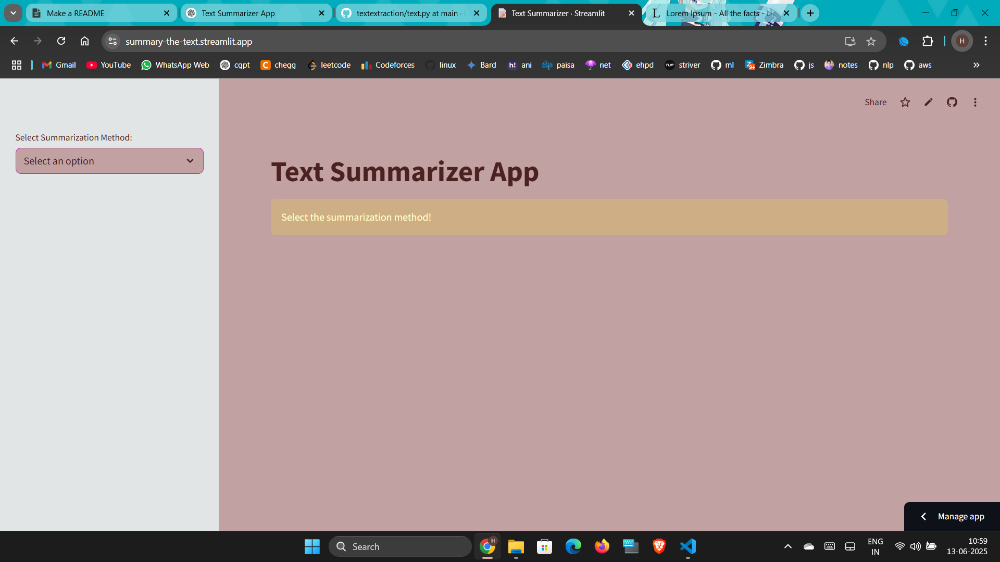
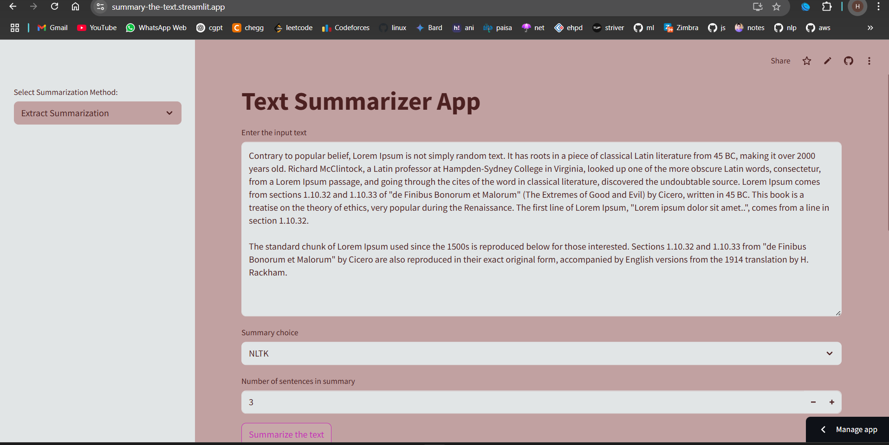
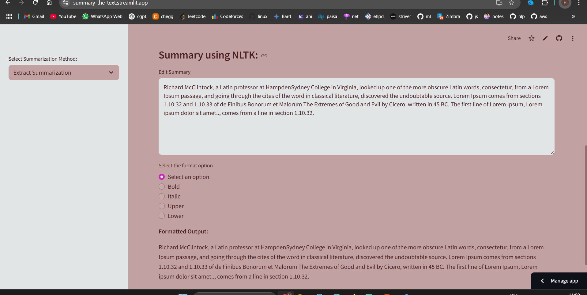
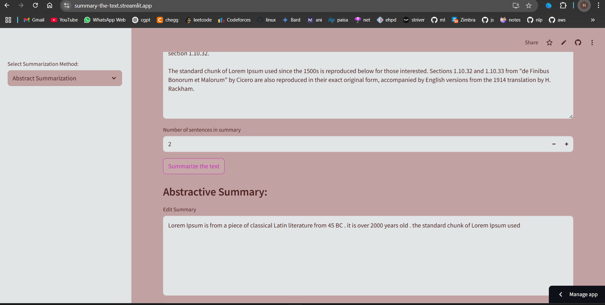
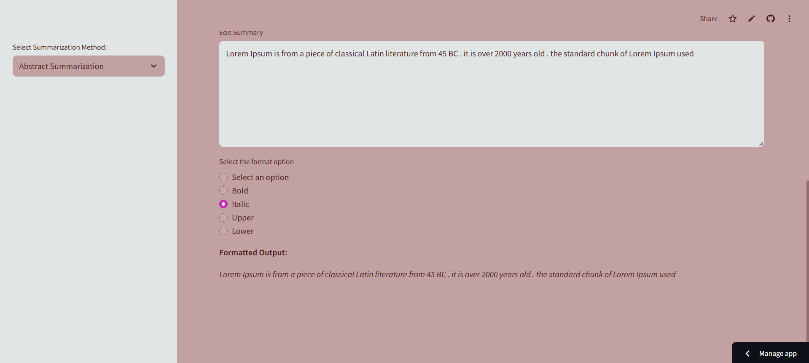

# Text Summarizer App

A Streamlit-based web application that summarizes text using:
-  **Abstractive summarization** (T5 Transformer from HuggingFace)
-  **Extractive summarization** (using NLTK and spaCy)
- **Text formatting options** (Bold, Italic, Uppercase, Lowercase)

---

##  Features

- **Extractive Summarization**
  - via NLTK (stemming, word frequency)
  - via spaCy (lemmatization, linguistic features)
- **Abstractive Summarization**
  - Uses HuggingFace's `t5-base` model
- **Text Formatting**
  - Allows formatting summary (Bold, Italic, Upper, Lower)
- **Editable Summary Output**

---

##  Installation & Setup Instructions

###  1. Clone the Repository

Open your terminal or command prompt and run:

```bash
git clone https://github.com/your-username/text-summarizer-app.git
cd text-summarizer-app
```

### 2. (Optional) Create a Virtual Environment
It is recommended to create a virtual environment:

```bash
# On Linux/macOS
python3 -m venv venv
source venv/bin/activate

# On Windows
python -m venv venv
venv\Scripts\activate
```
3. Install Python Dependencies
Install all required Python packages:

```bash
pip install -r requirements.txt

```
### 4. Download NLTK and spaCy Models
```bash
python -c "import nltk; nltk.download('punkt'); nltk.download('stopwords')"
python -m spacy download en_core_web_sm
```
###  5. Run the Application
Launch the Streamlit app:
```bash
streamlit run app.py
```


Then open your browser and go to:  [http://localhost:8501](http://localhost:8501)

## Screenshots

<div style="display: flex; overflow-x: auto;">
  
  
  
  
  
</div>

